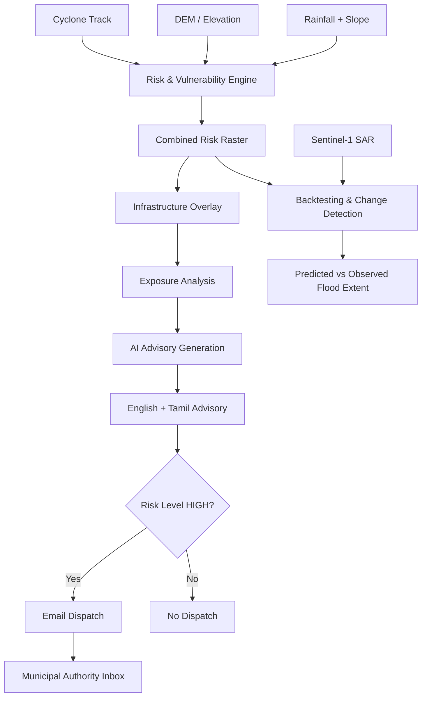

<div align="center">

# 🌊 Coastal Risk Advisor

### *Cyclone Impact & Infrastructure Vulnerability Forecaster*

**A decision-support platform for turning cyclone data into actionable coastal-risk intelligence.**

[](requirements.txt)
[](https://streamlit.io/)
[](https://fastapi.tiangolo.com/)
[](#disclaimer)

</div>

---

## 🧭 Overview

**Coastal Risk Advisor** is an interactive monitoring and decision-support system for estimating cyclone-related coastal risk, identifying exposed infrastructure, validating risk patterns against satellite-derived flood observations, and generating emergency advisories for affected zones.

The platform connects geospatial risk modelling with an operational response workflow:

> **Cyclone track → risk surface → infrastructure exposure → bilingual advisory → conditional dispatch**

It is designed as a demonstrator for municipal authorities, emergency planners, and data teams who need a clear view of *where risk is concentrated, what may be affected, and what action should follow*.

> ⚠️ **Important:** This repository contains a heuristic demonstration model. It is not a certified cyclone, storm-surge, flood, landslide, or evacuation forecast.

---

## ✨ Key Features

### 🌪️ Risk Intelligence

- Cyclone track visualization
- Holland wind-model-based wind-risk estimation
- DEM/elevation-aware coastal risk assessment
- Rainfall and slope-based flood/landslide risk signals
- Combined risk-raster generation

### 🏗️ Infrastructure Exposure

- Overlay risk surfaces with critical infrastructure
- Identify potentially exposed substations, roads, and shelters
- Support rapid prioritization of vulnerable assets

### 🛰️ Satellite Validation

- Cyclone Michaung backtesting workflow
- Sentinel-1 SAR change detection
- Comparison of predicted risk patterns with observed flood extent

### 🧠 AI-Assisted Response

- Gemini-powered emergency advisory generation
- English and Tamil advisory output
- Risk-aware response language for affected zones

### 📬 Dispatch & Operations

- Conditional email dispatch for high-risk scenarios
- Municipal authority inbox for demonstration workflows
- Local mock-inbox fallback when external email delivery is unavailable
- Mock-data and live-API operating modes

### 🖥️ Interactive Dashboard

- Streamlit-based monitoring interface
- Folium interactive maps
- End-to-end demonstration flow from track to dispatch

---

## 🏗️ System Architecture



### Component roles

| Component | Technology / Location | Role |
|---|---|---|
| Dashboard | `app.py` / Streamlit | Interactive monitoring and decision-support interface |
| Maps | Folium | Cyclone track, risk, and infrastructure visualization |
| Risk engine | Python, NumPy, Pandas | Wind, elevation, rainfall, slope, and combined-risk processing |
| API layer | FastAPI | Backend service for advisory and application integrations |
| Advisory layer | Gemini | AI-assisted emergency message generation |
| Validation | Sentinel-1 SAR | Satellite-based flood/change comparison |
| Dispatch | `dispatch/` | SMTP delivery and local mock-inbox fallback |
| Mock inputs | `mock/` | Reproducible demonstration data and advisory examples |

---

## 🔄 Core Workflow

```text
┌──────────────────────┐
│  Cyclone Track Data  │
└──────────┬───────────┘
           v
┌──────────────────────┐     ┌──────────────────────┐
│ Holland Wind Model   │     │ DEM / Rainfall /Slope│
│ Wind-Risk Surface    │     │ Flood & Elevation    │
└──────────┬───────────┘     └──────────┬───────────┘
           └──────────────┬─────────────┘
                          v
                 ┌────────────────┐
                 │ Combined Risk  │
                 │ Raster         │
                 └───────┬────────┘
                         v
                 ┌────────────────┐
                 │ Infrastructure │
                 │ Exposure       │
                 └───────┬────────┘
                         v
                 ┌────────────────┐
                 │ Advisory       │
                 │ Generation     │
                 └───────┬────────┘
                         v
                    ┌───────────┐
                    │ HIGH RISK?│
                    └─────┬─────┘
                    Yes    │    No
                     v     │     v
              ┌──────────┐  │  ┌────��───────┐
              │ Dispatch│  │  │ No Dispatch│
              └────┬─────┘  │  └────────────┘
                   v        │
          ┌────────────────┐ │
          │ Municipal     │ │
          │ Inbox         │ │
          └────────────────┘
```

---

## 🛰️ Michaung Backtesting

The backtesting workflow compares modelled risk with satellite-derived flood observations from Cyclone Michaung:

```text
Before SAR Image
        │
        v
Change Detection
        │
        v
Observed Flood Extent
        ▲
        │ comparison
        │
Predicted Risk Raster
(from the risk model)
```

This provides a visual validation layer for the demonstration model and helps communicate where modelled exposure agrees with, or differs from, observed flood change.

---

## 📁 Project Structure

```text
cyclone/
├── app.py                         # Streamlit dashboard entry point
├── dispatch/
│   ├── __init__.py
│   ├── email_dispatch.py          # SMTP dispatch integration
│   └── mock_inbox.py              # Local demonstration inbox
├── mock/
��   ├── advisory.json              # Example advisory data
│   └── track.geojson              # Example cyclone track
├── assets/
│   ├── risk_map.png               # Risk visualisation asset
│   └── backtest_comparison.png    # Michaung comparison asset
├── requirements.txt               # Python dependencies
├── test_email.py                  # Email/dispatch checks
├── render.yaml                    # Render deployment blueprint
└── README.md
```

---

## 🚀 Getting Started

### Prerequisites

- Python 3.10+
- `pip`
- Optional: Gemini API credentials for live advisory generation
- Optional: SMTP credentials for email dispatch

### Installation

```bash
git clone https://github.com/ShamrithaGS/cyclone.git
cd cyclone

python -m venv venv
source venv/bin/activate       # Windows: venv\\Scripts\\activate

pip install -r requirements.txt
```

### Run the dashboard

```bash
streamlit run app.py
```

Then open the local Streamlit URL shown in your terminal.

### Run the available checks

```bash
python test_email.py
```

---

## 🔐 Configuration

Create a `.env` file or configure environment variables in your deployment platform.

| Variable | Used by | Purpose |
|---|---|---|
| `GEMINI_API_KEY` | API / advisory layer | Enables live Gemini advisory generation |
| `EMAIL_ADDRESS` | Dashboard / dispatch | Sender email address |
| `EMAIL_APP_PASSWORD` | Dashboard / dispatch | SMTP app password |
| `TEST_EMAIL` | Dashboard / dispatch | Destination address for demonstration dispatch |

If live credentials are not configured, the application can use mock data and the local demonstration inbox for safe testing.

> 🔒 Never commit API keys, SMTP passwords, or other secrets to the repository.

---

## ☁️ Deployment on Render

The included `render.yaml` blueprint defines separate FastAPI and Streamlit web services.

1. Push the repository to GitHub.
2. In Render, select **New + → Blueprint**.
3. Connect `ShamrithaGS/cyclone`.
4. Apply the blueprint.
5. Add the required environment variables to the relevant services.

For a dashboard-only deployment, configure the service to start the Streamlit application with:

```bash
streamlit run app.py --server.address 0.0.0.0 --server.port $PORT
```

---

## 🎬 Demo Flow

```text
1. Launch the dashboard
          ↓
2. View the cyclone track
          ↓
3. Review the coastal risk assessment
          ↓
4. Inspect infrastructure exposure
          ↓
5. Compare the Michaung backtest
          ↓
6. Generate an English/Tamil advisory
          ↓
7. Check the calculated risk level
          ↓
8. If HIGH → dispatch email
          ↓
9. Review the municipal authority inbox
```

---

## 🧰 Technology Stack

| Area | Technology |
|---|---|
| Language | Python |
| Dashboard | Streamlit |
| Interactive maps | Folium |
| Backend APIs | FastAPI |
| Numerical processing | NumPy, Pandas |
| Risk modelling | Holland wind model, DEM, rainfall, slope signals |
| AI advisory | Gemini |
| Satellite validation | Sentinel-1 SAR |
| Communication | SMTP email |
| Deployment | Render |
| Version control | Git / GitHub |

---

## 🎯 Intended Use

This project is intended for:

- Emergency-management demonstrations
- Coastal-risk analysis prototypes
- Infrastructure vulnerability exploration
- Geospatial and satellite-validation workflows
- Bilingual public-safety communication experiments
- Hackathon and research presentations

It is **not** intended to replace official meteorological warnings, disaster-management authorities, evacuation orders, or certified engineering assessments.

---

## ⚠️ Disclaimer

The current risk assessment uses a heuristic demonstration model and is **not a certified cyclone, storm-surge, flood, landslide, infrastructure, or evacuation forecast**. Results should not be used as the sole basis for public-safety decisions. Always defer to official warnings and qualified emergency-management professionals.

External dispatch failures are handled through a local demonstration fallback so that the application remains usable during development and presentations.

---

<div align="center">

### 🌊 Turning hazard data into decisions — responsibly.

**Built for coastal resilience, infrastructure awareness, and faster emergency communication.**

</div>
